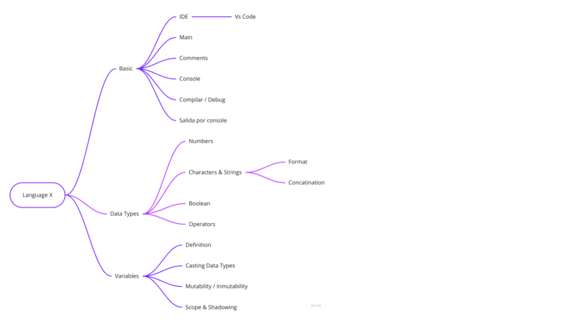

# multilanguage
## Objectives

This repository summarizes the relevant aspects of the following languages:
# Machine Oriented
- Rust
- Go

# Funcional orientated
- Clojure
- Elixir
- Scala

# Scritp oriented
- Typescript
- JavaScript

# Data oriented
- Python
- Julia

# Mobile oriented
- Kotlin
- Swift
- Dark

The topics to be reviewed in each language are as follows

