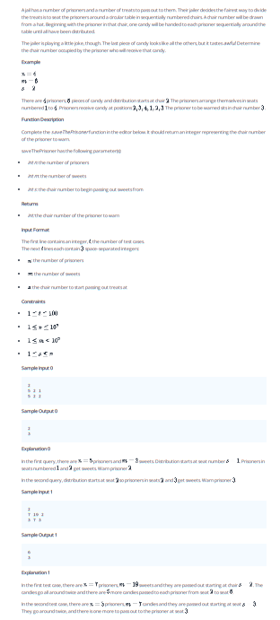

## Problem 008



## Problem: Save the Prisoner!

Ali has a number of prisoners and a number of treats to pass out to them. Their jailer decides the fairest way to divide the treats is to seat the prisoners around a circular table in sequentially numbered chairs. A chair number will be drawn from a hat. Beginning with the prisoner in that chair, one candy will be handed to each prisoner sequentially around the table until all have been distributed.

For example, there are 4 prisoners and 6 pieces of candy. The prisoners are seated in chairs numbered 1 to 4. The distribution will start at chair number 2. The prisoners receive candy at positions 2, 3, 4, 1, 2, 3. The prisoner to be warned sits in chair number 3.

### Function Description

Complete the `saveThePrisoner` function in the editor below. It should return an integer representing the chair number of the prisoner who will receive the last sweet.

`saveThePrisoner` has the following parameter(s):
- `int n`: the number of prisoners
- `int m`: the number of sweets
- `int s`: the chair number to begin passing out treats from

### Returns
- `int`: the chair number of the prisoner to warn

### Input Format

The first line contains an integer, `t`, the number of test cases.
The next `t` lines each contain three space-separated integers:
- `n`: the number of prisoners
- `m`: the number of sweets
- `s`: the chair number to begin passing out treats from

### Constraints

- \(1 \leq t \leq 100\)
- \(1 \leq n \leq 10^9\)
- \(1 \leq m \leq 10^9\)
- \(1 \leq s \leq n\)

### Sample Input 0
```plaintext
2
5 2 1
5 2 2
```

### Sample Output 0
```plaintext
2
3
```

### Explanation 0

**In the first query, there are `n = 5` prisoners and `m = 2` sweets. Distribution starts at seat number `s = 1`. Prisoners in seats numbered `1` and `2` get sweets. Warn prisoner `2`.**

**In the second query, distribution starts at seat `2` (prisoner 2) and sweets are given to `2` and `3`. Warn prisoner `3`.**

### Sample Input 1
```plaintext
7 19 2
```

### Sample Output 1
```plaintext
6
```

### Explanation 1

**In the first test case, there are `n = 7` prisoners, `m = 19` sweets, and they are passed out starting at chair `s = 2`. The candies go around the table exactly twice and there are 5 more candies passed out starting again at prisoner 1. The 19th candy will be handed to prisoner 6.**


