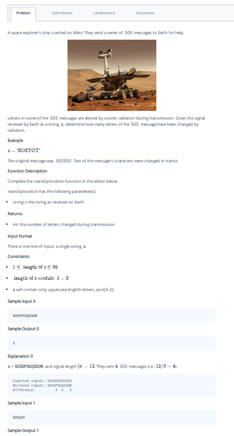

## Problem 009



Sure, here is the markdown document based on the provided image:

```markdown
## Problem: Mars Exploration

A space explorer's ship crashed on Mars! They send a series of SOS messages to Earth for help.

Letters in some of the SOS messages are altered by cosmic radiation during transmission. Given the signal received by Earth as a string, determine how many letters of the SOS message have been changed by radiation.

### Example
```plaintext
a = "SOSSPSSQSSOR"
The original message was SOSSOS. Two of the message's characters were changed in transit.
```

### Function Description

Complete the `marsExploration` function in the editor below.

`marsExploration` has the following parameter(s):
- `string s`: the string as received on Earth

Returns
- `int`: the number of letters changed during transmission

### Input Format

The first line contains a single string, `s`.

### Constraints
- \(1 \leq \text{length of } s \leq 99\)
- \(\text{length of } s \mod 3 = 0\)
- `s` will contain only uppercase English letters, ascii[A-Z].

### Sample Input
```plaintext
SOSSPSSQSSOR
```

### Sample Output
```plaintext
3
```

### Explanation
```plaintext
a = SOSSPSSQSSOR, and signal length |s| = 12. They sent 4 SOS messages (i.e. 12/3 = 4).

Expected signal: SOSSOSSOSSOS
Received signal: SOSSPSSQSSOR
Difference:          X  X   X
```

There is one line of input: a single string, `s`.

### Code Implementation

```python
def marsExploration(s):
    # Initialize the counter for altered letters
    altered_count = 0
    
    # Compare each group of 3 characters in the received string with "SOS"
    for i in range(0, len(s), 3):
        if s[i] != 'S':
            altered_count += 1
        if s[i + 1] != 'O':
            altered_count += 1
        if s[i + 2] != 'S':
            altered_count += 1
    
    return altered_count

if __name__ == '__main__':
    s = input("Enter the received signal: ").strip()
    result = marsExploration(s)
    print(result)
```
```

This markdown document provides a clear problem statement, constraints, sample input and output, explanation, and the solution code, formatted in an easy-to-read manner.