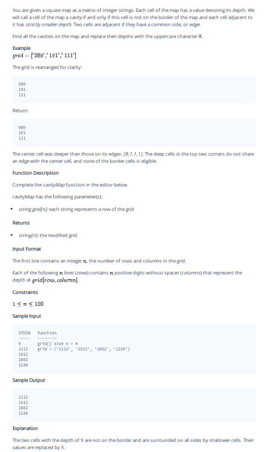

## Problem 010



## Problem: Cavity Map

You are given a square map as a matrix of integer strings. Each cell of the map has a value denoting its depth. We will call a cell of the map a cavity if and only if this cell is not on the border of the map and each cell adjacent to it has strictly smaller depth. Two cells are adjacent if they have a common side, or edge.

Find all the cavities on the map and replace their depths with the uppercase character `X`.

### Example
```plaintext
grid = ["989", "191", "111"]
```
The grid is rearranged for clarity:
```plaintext
989
191
111
```

Return:
```plaintext
989
1X1
111
```

The center cell was deeper than those on its edges: `[8, 1, 1, 1]`. The deep cells in the top two corners do not share an edge with the center cell, and none of the border cells is eligible.

### Function Description

Complete the `cavityMap` function in the editor below.

`cavityMap` has the following parameter(s):
- `string grid[n]`: each string represents a row of the grid

Returns:
- `string[n]`: the modified grid

### Input Format

The first line contains an integer `n`, the number of rows and columns in the grid.

Each of the following `n` lines contains a positive digit without spaces (columns) that represent the depth at `grid[i][j]`.

### Constraints

- \(1 \leq n \leq 100\)

### Sample Input
```plaintext
4
1112
1912
1892
1234
```

### Sample Output
```plaintext
1112
1X12
18X2
1234
```

### Explanation

The two cells with the depth of 9 are not on the border and are surrounded on all sides by shallower cells. Their values are replaced by `X`.

