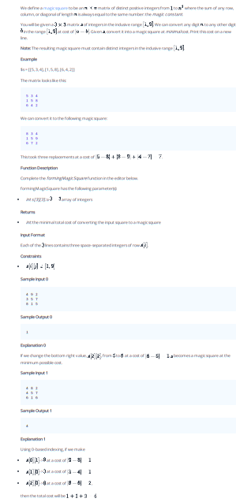

## Problem 011



## Problem: Forming a Magic Square

We define a magic square to be an `n x n` matrix of distinct positive integers from 1 to \( n^2 \) where the sum of any row, column, or diagonal (of length `n`) is always equal to the same number (the magic constant).

You will be given a `3 x 3` matrix of integers in the inclusive range \([1, 9]\). We can convert any digit \(a\) to any other digit \(b\) in the range \([1, 9]\) at a cost of \(|a - b|\). Given an initial configuration of the matrix, find the cost of converting it into a magic square.

### Example

```plaintext
s = [[4, 8, 2], [4, 5, 7], [6, 1, 6]]
```

The matrix looks like this:

```plaintext
4 8 2
4 5 7
6 1 6
```

We can convert it to the following magic square:

```plaintext
8 3 4
1 5 9
6 7 2
```

This took three replacements at a cost of \(|4 - 8| + |8 - 3| + |6 - 7| = 4 + 5 + 1 = 7\).

### Function Description

Complete the `formingMagicSquare` function in the editor below.

`formingMagicSquare` has the following parameter(s):
- `int s[3][3]`: a `3 x 3` array of integers

Returns:
- `int`: the minimal total cost of converting the input square to a magic square

### Input Format

Each of the 3 lines contains three space-separated integers of row \(s[i]\).

### Constraints

- \( s[i][j] \in [1, 9] \)

### Sample Input 0

```plaintext
4 9 2
3 5 7
8 1 5
```

### Sample Output 0

```plaintext
1
```

### Explanation 0

If we change the bottom right value, \(s[2][2]\), from 5 to 6 at a cost of \(|5 - 6| = 1\), \(s\) becomes a magic square at the minimal possible cost.

### Sample Input 1

```plaintext
4 8 2
4 5 7
6 1 6
```

### Sample Output 1

```plaintext
4
```

### Explanation 1

Using 0-based indexing, if we make the following changes:
- Change \(s[0][1]\) from 8 to 3 at a cost of \(|8 - 3| = 5\).
- Change \(s[1][0]\) from 4 to 1 at a cost of \(|4 - 1| = 3\).

Then the total cost will be \(5 + 3 = 8\).

### Code Implementation


