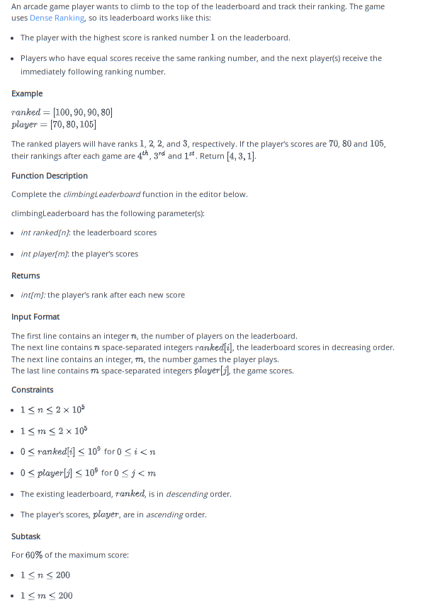

## Problem 012

## Climbing Leaderboard Solution

### Problem Statement
An arcade game player wants to climb to the top of the leaderboard and track their ranking. The game uses Dense Ranking, so its leaderboard works like this:
- The player with the highest score is ranked number 1 on the leaderboard.
- Players who have equal scores receive the same ranking number, and the next player(s) receive the immediately following ranking number.

### Example
Given the leaderboard scores `[100, 90, 90, 80]` and the player's scores `[70, 80, 105]`, the ranked players will have ranks 1, 2, 2, and 3, respectively. If the player's scores are 70, 80, and 105, their rankings after each game are 4th, 3rd, and 1st. Return `[4, 3, 1]`.

### Function Description
Complete the `climbingLeaderboard` function in the editor below.

### Input Format
The first line contains an integer `n`, the number of players on the leaderboard.  
The next line contains `n` space-separated integers `ranked[i]`, the leaderboard scores in decreasing order.  
The next line contains an integer `m`, the number of games the player plays.  
The last line contains `m` space-separated integers `player[j]`, the game scores.

### Constraints
- `1 ≤ n ≤ 2 × 10^5`
- `1 ≤ m ≤ 2 × 10^5`
- `0 ≤ ranked[i] ≤ 10^9` for `0 ≤ i < n`
- `0 ≤ player[j] ≤ 10^9` for `0 ≤ j < m`
- The existing leaderboard, `ranked`, is in descending order.
- The player's scores, `player`, are in ascending order.

### Explanation
The function first removes duplicates from the leaderboard and sorts it in descending order. Then, for each of the player's scores, it finds the appropriate rank by comparing the score with the unique ranks from the end to the beginning. The rank is determined based on the position where the player's score fits within the existing ranks.

