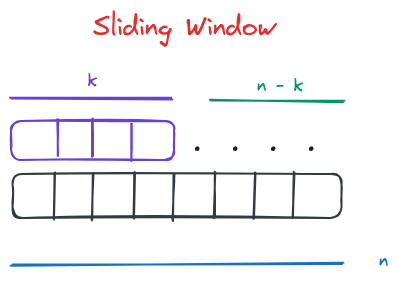
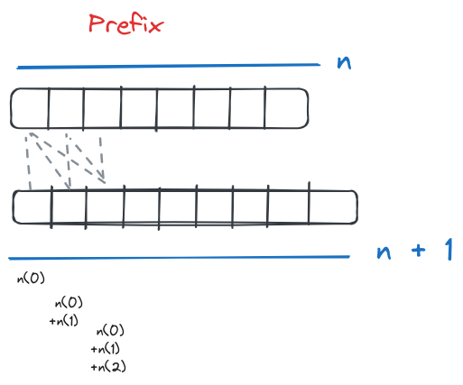
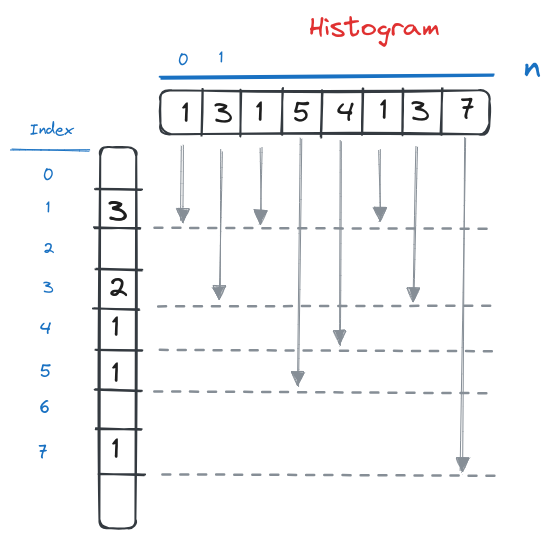
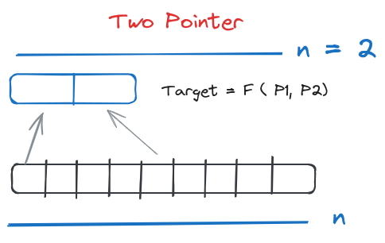
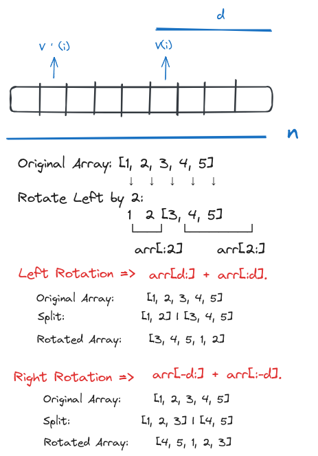

# Coding Patterns for Challenges

## Pattern 1: Sliding Window



### Description:
The sliding window technique involves creating a moving subarray (or window) of a fixed size that slides over the array to perform operations efficiently. This technique is especially useful for problems involving sums, averages, or other metrics over subarrays of a fixed size.

### Use Cases:
1. **Maximum Sum Subarray of Fixed Size:** Finding the maximum sum of any subarray of a given length.
2. **Longest Substring Without Repeating Characters:** Determining the length of the longest substring without repeating characters in a string.
3. **Average of All Sub arrays of Size K:** Calculating the average of all subarrays of a fixed length `k`.

---

## Pattern 2: Prefix Sums



### Description:
The prefix sum technique involves creating an array where each element at index `i` contains the sum of the array elements from the start up to index `i`. This technique helps in efficiently calculating the sum of any subarray.

### Use Cases:
1. **Range Sum Query:** Quickly finding the sum of elements between two given indices in an array.
2. **Subarray Sum Equals K:** Counting the number of subarrays that sum up to a given value `k`.
3. **Equilibrium Index:** Finding an index where the sum of elements to the left is equal to the sum of elements to the right.

---

## Pattern 3: Array-based Histogram



### Description:
An array-based histogram is a technique that uses an array to count the occurrences of elements within a given value range. The indices of the array represent the values, and the elements at these indices represent the counts.

### Use Cases:
1. **Equalize the Array:** Determining the minimum number of elements to delete to leave only elements of equal value.
2. **Find the Most Frequent Element:** Identifying the element with the highest frequency in an array.
3. **Character Frequency Count:** Counting the frequency of characters in a string for problems like anagram checks.

## Pattern 4: Two Pointers


   
### Description: 

A technique where two pointers are used to iterate through the array from different ends or based on conditions to reduce the complexity.

### Use Cases:
- Finding pairs in an array that sum up to a target
- Removing duplicates from a sorted array
- Container with most water


## Pattern 5: Array Rotation



### Description:

Array rotation involves shifting the elements of an array to the left or right by a certain number of positions. This pattern helps in rearranging elements efficiently using slicing techniques.

### Formulas:

- **Left Rotation:**
  - **Formula:** `rotated_array = array[d:] + array[:d]`
  - **Explanation:** Split the array into two parts at index `d` and concatenate the second part with the first part.
  
- **Right Rotation:**
  - **Formula:** `rotated_array = array[-d:] + array[:-d]`
  - **Explanation:** Split the array into two parts at index `-d` and concatenate the last part with the first part.

### Use Cases:

- Shifting elements in circular queues
- Cryptography and data obfuscation
- Music playlists rotations
- Solving problems involving circular data structures

### Example Code for Both Rotations

```python
def left_rotate(arr, d):
    n = len(arr)
    d = d % n  # In case d > n
    return arr[d:] + arr[:d]

def right_rotate(arr, d):
    n = len(arr)
    d = d % n  # In case d > n
    return arr[-d:] + arr[:-d]

# Example usage:
arr = [1, 2, 3, 4, 5]
d = 2

print("Left Rotation:", left_rotate(arr, d))  # Output: [3, 4, 5, 1, 2]
print("Right Rotation:", right_rotate(arr, d))  # Output: [4, 5, 1, 2, 3]
```

### Diagrams

#### Left Rotation Diagram
```
Original Array:    [1, 2, 3, 4, 5]
Split:             [1, 2] | [3, 4, 5]
Rotated Array:     [3, 4, 5, 1, 2]
```

#### Right Rotation Diagram
```
Original Array:    [1, 2, 3, 4, 5]
Split:             [1, 2, 3] | [4, 5]
Rotated Array:     [4, 5, 1, 2, 3]
```

