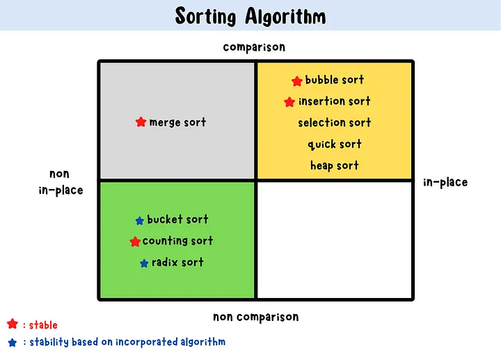

### Sorting Algorithms Summary

#### 1. **Bubble Sort**
- **Description:** Repeatedly swaps adjacent elements if they are in the wrong order.
- **Complexity:** \(O(n^2)\) average and worst-case.

#### 2. **Selection Sort**
- **Description:** Finds the minimum element and swaps it with the first unsorted element.
- **Complexity:** \(O(n^2)\) average and worst-case.

#### 3. **Insertion Sort**
- **Description:** Builds the sorted array one element at a time by comparing and inserting elements into their correct positions.
- **Complexity:** \(O(n^2)\) average and worst-case.

#### 4. **Merge Sort**
- **Description:** Divides the array into halves, sorts each half, and merges them.
- **Complexity:** \(O(n \log n)\) for all cases.

#### 5. **Quick Sort**
- **Description:** Picks a pivot, partitions the array around the pivot, and recursively sorts the partitions.
- **Complexity:** \(O(n \log n)\) average, \(O(n^2)\) worst-case.

#### 6. **Heap Sort**
- **Description:** Converts the array into a heap, repeatedly extracts the maximum element, and rebuilds the heap.
- **Complexity:** \(O(n \log n)\) for all cases.

#### 7. **Counting Sort**
- **Description:** Counts the occurrences of each element, then places them in the sorted order.
- **Complexity:** \(O(n + k)\), where \(k\) is the range of the input.

#### 8. **Radix Sort**
- **Description:** Sorts numbers by processing individual digits.
- **Complexity:** \(O(d \times (n + k))\), where \(d\) is the number of digits and \(k\) is the range of digits.

#### 9. **Bucket Sort**
- **Description:** Distributes elements into buckets, sorts each bucket, and concatenates the results.
- **Complexity:** \(O(n + k)\), where \(k\) is the number of buckets.

These algorithms vary in their complexity and use cases, making some more suitable for specific tasks than others.