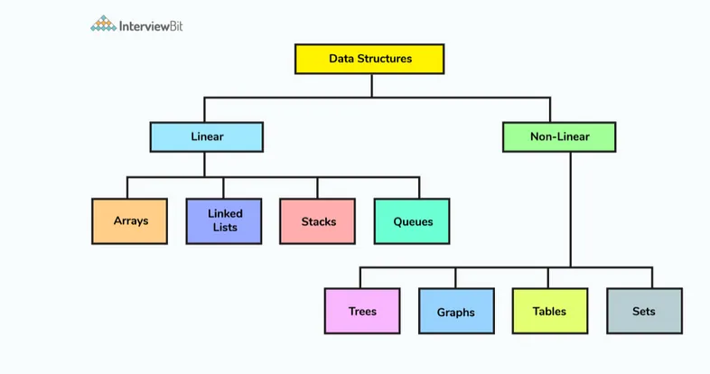

# Data structure
A data structure is a way of organizing and storing data in a computer so that it can be accessed and modified efficiently. Examples of data structures include arrays, linked lists, stacks, queues, trees, and graphs.

**Importance of Data Structures**:

1. **Efficiency**: Proper use of data structures can significantly improve the efficiency of algorithms, making programs run faster and use less memory.

2. **Data Organization**: Data structures help in organizing data in a structured manner, which makes it easier to manage and manipulate.

3. **Reusability**: Well-designed data structures can be reused across different programs, reducing redundancy and effort.

4. **Scalability**: Effective data structures can handle increasing amounts of data and scale efficiently, which is essential for large applications.

5. **Complex Problem Solving**: Many complex problems can be simplified using appropriate data structures, enabling more straightforward implementation of solutions.

## Types of data structures

| Type           | Definition                                                                 | Use Cases                                         | Common Operations                             |
|----------------|-----------------------------------------------------------------------------|--------------------------------------------------|-----------------------------------------------|
| [**Array**](./array.md)      | A collection of elements identified by index or key.                       | Storing data in a fixed-size sequence, quick access to elements | Access, insert, delete, traverse             |
| [**Linked List**](./linked_lists.md)| A sequence of nodes, where each node points to the next node.             | Dynamic memory allocation, easy insertion/deletion at the beginning or end | Insert, delete, traverse, search             |
| [**Stack**](./stack_queue.md)      | A collection of elements with Last In First Out (LIFO) access.            | Expression evaluation, backtracking algorithms, undo mechanisms | Push, pop, peek, isEmpty                     |
| [**Queue**](./stack_queue.md)      | A collection of elements with First In First Out (FIFO) access.           | Order processing, breadth-first search, scheduling tasks | Enqueue, dequeue, peek, isEmpty              |
| **Tree**       | A hierarchical structure with nodes, each having zero or more child nodes.| Hierarchical data storage, databases, file systems, XML/HTML parsing | Insert, delete, traverse (pre-order, in-order, post-order) |
| **Binary Tree**| A tree where each node has at most two children.                          | Efficient searching and sorting, binary search trees | Insert, delete, traverse, search             |
| **Heap**       | A specialized tree-based data structure that satisfies the heap property. | Priority queues, graph algorithms, scheduling   | Insert, delete, peek, heapify                |
| [**Graph**](./graph.md)      | A collection of nodes (vertices) and edges connecting them.               | Network routing, social networks, recommendation systems | Add vertex, add edge, remove vertex, remove edge, traverse (DFS, BFS) |
| [**Hash Table**](./hashtable.md) | A data structure that maps keys to values using a hash function.          | Fast data retrieval, database indexing, caching  | Insert, delete, search, update               |
| **Tree**       | A tree-like data structure that stores a dynamic set of strings.          | Autocomplete, spell check, IP routing            | Insert, delete, search, traverse             |

