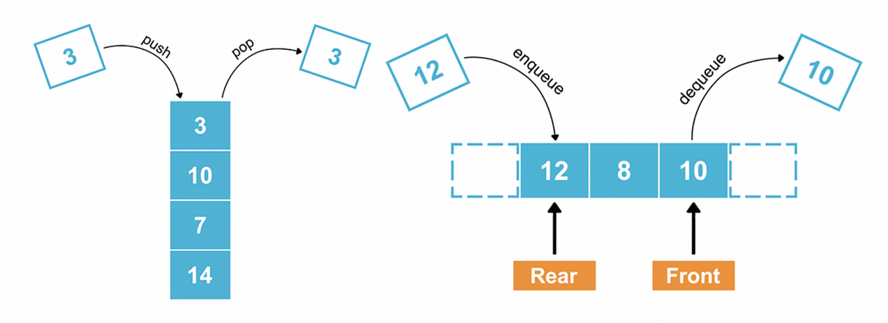

## Stack

**Definition:**
An array-like data structure whose elements follow the LIFO rule: Last In, First Out.

A stack is often compared to a stack of books on a table: the last book that’s placed on the stack of books is the first one that’s taken off the stack.

**Common Operations and Complexity Analysis:**

- **Pushing an element onto the stack:** O(1)
- **Popping an element off the stack:** O(1)
- **Peeking at the element on the top of the stack:** O(1)
- **Searching for an element in the stack:** O(n)

A stack is typically implemented with a dynamic array or with a singly linked list.

**Use Cases:**

- Expression evaluation and syntax parsing (e.g., parsing expressions, evaluating postfix expressions).
- Backtracking algorithms (e.g., finding paths in mazes, undo mechanisms in text editors).
- Function call management (e.g., call stack in programming languages).

## Queue

**Definition:**
An array-like data structure whose elements follow the FIFO rule: First In, First Out.

A queue is often compared to a group of people standing in line to purchase items at a store: the first person to get in line is the first one to purchase items and to get out of the queue.

**Common Operations and Complexity Analysis:**

- **Enqueuing an element into the queue:** O(1)
- **Dequeuing an element out of the queue:** O(1)
- **Peeking at the element at the front of the queue:** O(1)
- **Searching for an element in the queue:** O(n)

A queue is typically implemented with a doubly linked list.

**Use Cases:**

- Order processing and task scheduling (e.g., print queue, CPU task scheduling).
- Breadth-first search in graph algorithms.
- Handling of asynchronous data (e.g., message queues, buffering in IO operations).

** Visualization **



## Examples

Here are examples showing how to create and perform basic operations on stacks and queues in various programming languages:

### Python

#### Stack

```python
# Using list as a stack
stack = []

# Add item (push)
stack.append(1)

# Update item (not common in stack, but can access directly)
stack[-1] = 2

# Remove item (pop)
stack.pop()

# Example usage
print(stack)
```

#### Queue

```python
from collections import deque

# Using deque as a queue
queue = deque()

# Add item (enqueue)
queue.append(1)

# Update item (not common in queue, but can access directly)
queue[0] = 2

# Remove item (dequeue)
queue.popleft()

# Example usage
print(queue)
```

### TypeScript

#### Stack

```typescript
// Using array as a stack
let stack: number[] = [];

// Add item (push)
stack.push(1);

// Update item (not common in stack, but can access directly)
stack[stack.length - 1] = 2;

// Remove item (pop)
stack.pop();

// Example usage
console.log(stack);
```

#### Queue

```typescript
// Using array as a queue
let queue: number[] = [];

// Add item (enqueue)
queue.push(1);

// Update item (not common in queue, but can access directly)
queue[0] = 2;

// Remove item (dequeue)
queue.shift();

// Example usage
console.log(queue);
```

### Golang

#### Stack

```go
package main

import "fmt"

func main() {
    var stack []int

    // Add item (push)
    stack = append(stack, 1)

    // Update item (not common in stack, but can access directly)
    stack[len(stack)-1] = 2

    // Remove item (pop)
    stack = stack[:len(stack)-1]

    // Example usage
    fmt.Println(stack)
}
```

#### Queue

```go
package main

import "fmt"

func main() {
    var queue []int

    // Add item (enqueue)
    queue = append(queue, 1)

    // Update item (not common in queue, but can access directly)
    queue[0] = 2

    // Remove item (dequeue)
    queue = queue[1:]

    // Example usage
    fmt.Println(queue)
}
```

### C++

#### Stack

```cpp
#include <iostream>
#include <stack>

int main() {
    std::stack<int> stack;

    // Add item (push)
    stack.push(1);

    // Update item (not common in stack, but can access directly)
    // Note: You typically don't update items in a stack, so this is just for example purposes.
    stack.top() = 2;

    // Remove item (pop)
    stack.pop();

    // Example usage
    std::cout << "Stack is empty: " << std::boolalpha << stack.empty() << std::endl;

    return 0;
}
```

#### Queue

```cpp
#include <iostream>
#include <queue>

int main() {
    std::queue<int> queue;

    // Add item (enqueue)
    queue.push(1);

    // Update item (not common in queue, but can access directly)
    // Note: You typically don't update items in a queue, so this is just for example purposes.
    queue.front() = 2;

    // Remove item (dequeue)
    queue.pop();

    // Example usage
    std::cout << "Queue is empty: " << std::boolalpha << queue.empty() << std::endl;

    return 0;
}
```

### Rust

#### Stack

```rust
fn main() {
    let mut stack: Vec<i32> = Vec::new();

    // Add item (push)
    stack.push(1);

    // Update item (not common in stack, but can access directly)
    if let Some(last) = stack.last_mut() {
        *last = 2;
    }

    // Remove item (pop)
    stack.pop();

    // Example usage
    println!("{:?}", stack);
}
```

#### Queue

```rust
use std::collections::VecDeque;

fn main() {
    let mut queue: VecDeque<i32> = VecDeque::new();

    // Add item (enqueue)
    queue.push_back(1);

    // Update item (not common in queue, but can access directly)
    if let Some(front) = queue.front_mut() {
        *front = 2;
    }

    // Remove item (dequeue)
    queue.pop_front();

    // Example usage
    println!("{:?}", queue);
}
```

### Java

#### Stack

```java
import java.util.Stack;

public class Main {
    public static void main(String[] args) {
        Stack<Integer> stack = new Stack<>();

        // Add item (push)
        stack.push(1);

        // Update item (not common in stack, but can access directly)
        stack.set(stack.size() - 1, 2);

        // Remove item (pop)
        stack.pop();

        // Example usage
        System.out.println(stack);
    }
}
```

#### Queue

```java
import java.util.LinkedList;
import java.util.Queue;

public class Main {
    public static void main(String[] args) {
        Queue<Integer> queue = new LinkedList<>();

        // Add item (enqueue)
        queue.add(1);

        // Update item (not common in queue, but can access directly)
        ((LinkedList<Integer>) queue).set(0, 2);

        // Remove item (dequeue)
        queue.poll();

        // Example usage
        System.out.println(queue);
    }
}
```

### Kotlin

#### Stack

```kotlin
fun main() {
    val stack = mutableListOf<Int>()

    // Add item (push)
    stack.add(1)

    // Update item (not common in stack, but can access directly)
    stack[stack.size - 1] = 2

    // Remove item (pop)
    stack.removeAt(stack.size - 1)

    // Example usage
    println(stack)
}
```

#### Queue

```kotlin
fun main() {
    val queue = ArrayDeque<Int>()

    // Add item (enqueue)
    queue.add(1)

    // Update item (not common in queue, but can access directly)
    queue[0] = 2

    // Remove item (dequeue)
    queue.removeFirst()

    // Example usage
    println(queue)
}
```

